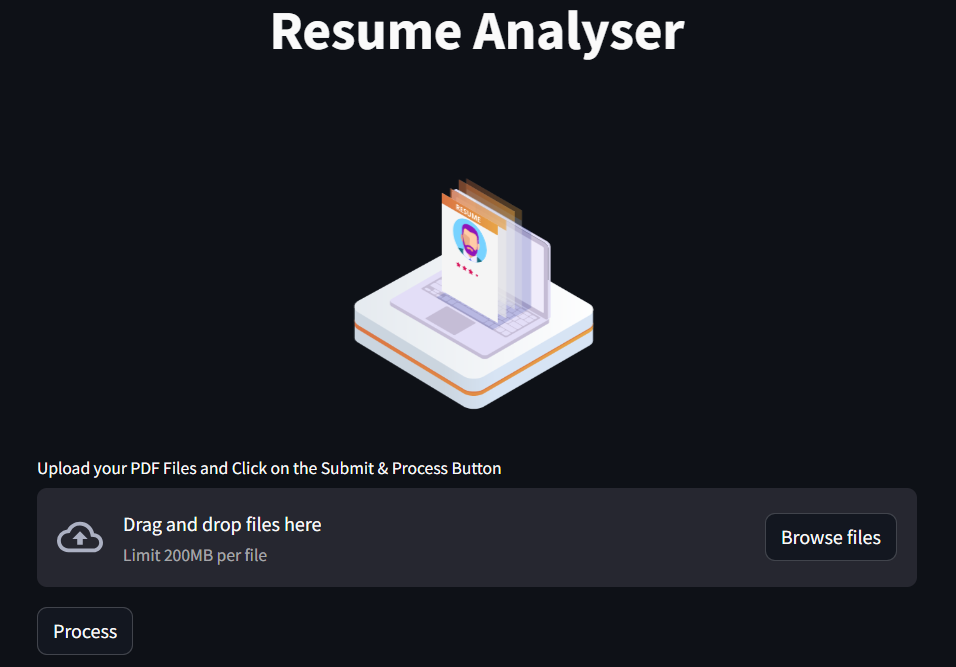
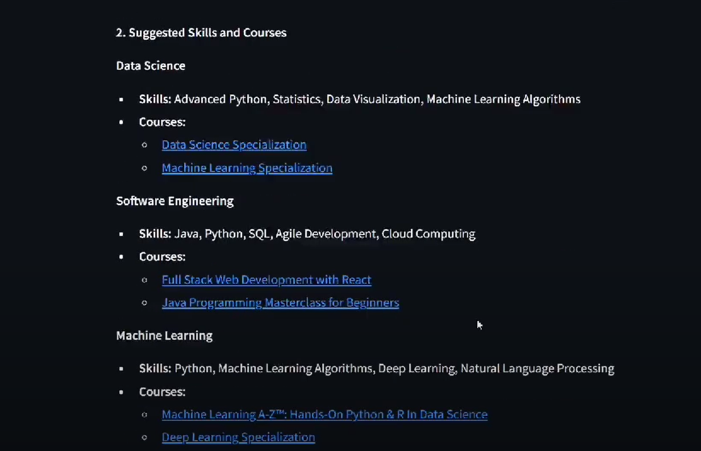
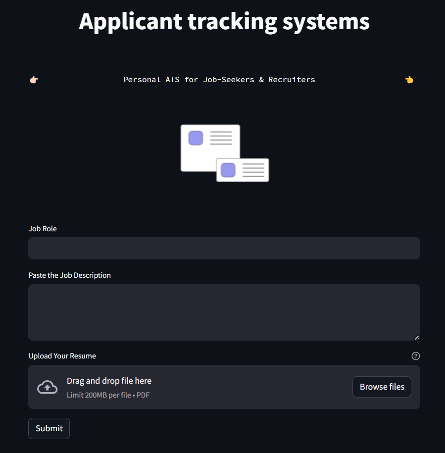
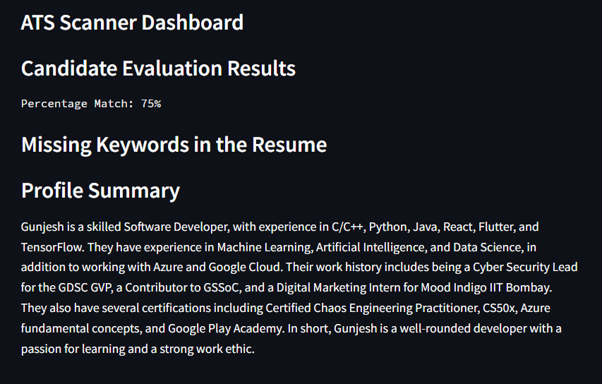

# 🎓🤖College.ai

Welcome to College.ai !! It  is a versatile project that harnesses the power of ChatGPT-4 to provide a range of features. The application includes functionalities such as exploring ChatGPT-4 features, training/uploading PDFs, resume analysis, and more.🎓🤖


https://youtu.be/K2QHmboTf8o?si=42LbPMeTPQYCDgNX

## Table of Contents
- [Introduction](#introduction)
- [Features](#Features)
- [Dependencies](#dependencies)
- [Installation](#installation)
- [Getting Started](#getting-started)
- [Folder Structure](#folder-structure)
- [Contributing](#contributing)
- [License](#license)

## 🚀Introduction

 College.ai , your comprehensive solution for exploring the capabilities of ChatGPT-4! This project offers a variety of features, including a Home page, an About section, Ask_To_PDF functionality for training/uploading PDFs, Resume_Analyser for analyzing resumes, ATS for matching job descriptions and resumes, and examples for prompting in Ask to PDF.

## Features
 - Home Page: Introduction to College.ai.
 - About Section: Information about the creator and project details.
 - Ask_To_PDF Functionality: Train/upload PDFs and make queries.
 - Resume_Analyser: Analyze resumes and provide recommendations.
 - Applicant Tracking System (ATS): Match job descriptions with resumes and provide feedback.
 - Prompt Examples: Examples for prompting in Ask to PDF.

 ## Example Usage

### Ask_To_PDF
1. Upload your PDF file.
   
2. Type your query related to the content of the PDF.
   
3. Receive the response based on the PDF content.
   

### Resume_Analyser
1. Upload your resume.
   
2. Get detailed analysis and recommendations for improvement.
   

### ATS
1. Upload your resume and job description.
   
2. Get a match score and feedback to improve your resume for the job.
   


## Dependencies

Make sure you have the following dependencies installed:

- [Streamlit](https://streamlit.io/)
- [google-generativeai](https://github.com/googleapis/python-generators)
- [python-dotenv](https://github.com/theskumar/python-dotenv)
- [langchain](https://github.com/lukasschwab/langchain)
- [PyPDF2](https://pythonhosted.org/PyPDF2/)
- [faiss-cpu](https://github.com/facebookresearch/faiss)
- [langchain_google_genai](https://github.com/googleapis/python-generators)
- [pdf2image](https://github.com/Belval/pdf2image)
- [poppler-utils](https://poppler.freedesktop.org/)
- [streamlit_lottie](https://github.com/okld/streamlit-lottie)


## 🛠️Installation

1. Clone the repository
First, you need to clone the repository to your local machine. You can do this by using the git clone command followed by the URL of the repository.

```bash
git clone <link>
```

2. Navigate to the project directory:

```bash
cd <filename>
```
3. Create a new branch
It's a good practice to create a new branch for your changes. You can create a new branch with the git branch command and switch to it with the git checkout command.

```bash
git branch my-branch
git checkout my-branch
```
Or you can use the git checkout command with the -b flag to create and switch to the new branch in one step.
```bash
git checkout -b my-branch
```
4. Make changes
Now you can make changes to the files in the repository. You can use any text editor or IDE to do this.

5. Stage the changes
Once you've made your changes, you need to stage them with the git add command.
```bash
git add.
```
The . adds all changes, but you can also specify individual files.

6. Commit the changes
After staging your changes, you need to commit them with the git commit command.
```bash
git commit -m "Commit message"
```
The -m flag allows you to write a commit message that describes the changes you made.

7. Push the changes
Now you can push your changes to the remote repository with the git push command.
```bash
git push origin my-branch
```
8. Create a pull request
Finally, you can create a pull request on the GitHub website. This will allow the repository owner to review your changes and decide whether to merge them into the main branch.


##Install requirements:

```bash
pip install -r requirements.txt
```


## Getting Started

To start the application, run the following command:

```bash
streamlit run <app.py>
```

This will launch the College.ai application in your default web browser.

## Folder Structure

- **Pages/**
  - `home.py`: Home page with an introduction to College.ai.
  - `About.py`: Information about the creator and other details.
  - `Ask_To_PDF.py`: Functionality to train/upload PDFs and make queries.
  - `Resume_Analyser.py`: Analyze resumes and provide recommendations.
  - `ATS.py`: Match job descriptions with resumes and show feedback.
  - `Prompt_Examples.py`: Examples for prompting in Ask to PDF.

## 🤝Contributing

If you'd like to contribute to College.ai, please follow these steps:

1. Fork the repository.
2. Create a new branch for your feature or bug fix.
3. Make changes and commit them.
4. Push your changes to your fork.
5. Create a pull request.

Note: Make sure you always create a updated PR.


#### Contibuting Guidelines 
  We believe in the power of collaboration. If you have ideas to improve College.ai, feel free to contribute! Check out our [Contribution Guidelines]https://github.com/SurajSanap/College.ai-main/blob/main/CONTRIBUTION.md to get started.

### 📄 Documentation

Explore our comprehensive documentation in the [LEARN.md]https://github.com/SurajSanap/College.ai-main/blob/main/Learn.md file, which serves as a detailed guide to understanding and contributing to College.ai. This document covers various aspects of the project, including setup instructions, architecture overview, and contribution guidelines. We recommend referring to this documentation to gain a deeper insight into UniCollab and make meaningful contributions to its development.

## 📝License

This project is licensed under the [MIT License](LICENSE). Feel free to use, modify, and distribute the code as per the terms of the license.

### 🌟 Join Us 

Ready to embark on a journey of collaborative learning? Join College.ai now and be a part of a community that believes in the power of collaboration!
Thank you for contributing to our open-source project! We appreciate your support 🚀
Don't forget to leave a star ⭐
Happy Coding!!❤️


<p align="right">{<a href="#top">Back to top</a>}</p>
